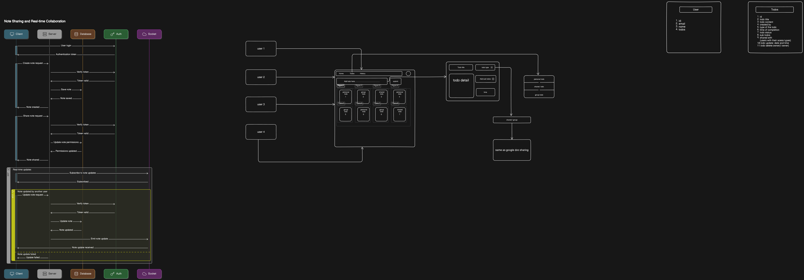

# TODO / Notes Taking App Shared System

# Technical Design Document
## 1. Introduction
- **Purpose**: 
- **Scope**: 
- **Definitions**:
## 2. System Overview
- **Architecture Diagram**: 
- **Components**: 
    - Express Server
    - MongoDB Database
    - WebSocket Server
    - Authentication Service
## 3. Data Models and Schemas
- **User Model**: 
- **Note Model**: 
- **Sharing Permissions**:
## 4. Backend Setup
### 4.1 Express Server
- **Routes**: 
- **Middleware**:
### 4.2 MongoDB Database
- **Schema Definitions**: 
- **Mongoose Models**:
### 4.3 WebSocket Server
- **Real-time Communication**: 
- **Event Handling**:
### 4.4 Authentication Service
- **User Authentication**: 
- **Authorization**:
## 5. Frontend Setup
### 5.1 User Interface Components
- **Login/Signup**: 
- **Note Creation**: 
- **Note Sharing**:
### 5.2 State Management
- **Global State**: 
- **Local State**:
### 5.3 API Request Handling
- **Axios Configuration**: 
- **API Endpoints**:
### 5.4 Real-time Updates
- **Socket.io Client**: 
- **Event Listeners**:
## 6. Security Considerations
- **User Authentication**: 
- **Data Validation**: 
- **Access Control**: 
- **Encryption Methods**:
## 7. Performance Metrics
- **Response Time**: 
- **Throughput**: 
- **Scalability**: 
- **Resource Utilization**:
## 8. Deployment Plan
- **Deployment Environment**: 
- **Monitoring and Logging**:
## 9. Testing Strategy
- **Unit Tests**: 
- **Integration Tests**: 
- **End-to-End Tests**:
## 10. Maintenance and Support
- **Maintenance Guidelines**: 
- **Support Resources**:
## 11. Appendices
- **Glossary**: 
- **References**: 
- **Additional Information**:

